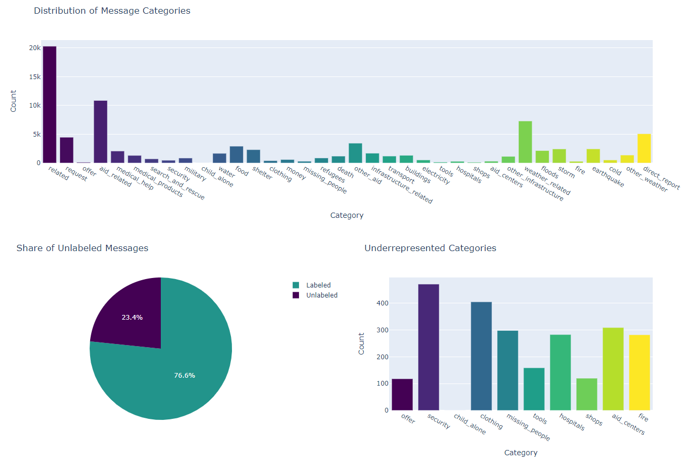

# Disaster Response Pipeline Project
## Overview
In this project, I first cleaned a database of text messages to prepare them for a classification model (lower case, remove stop words, lemmatization). I then created a pipeline for vectorizing the text before passing it to a model for training. After performing a GridSearch on a few different model architectures, I settled on XGBoost as tree-based (and boosted) models generally perform better on a sparse dataset (which was the case for my text-based dataset here). This repo contains the final weights of the trained pipeline in `models/classifier.pkl`. 

You can see this model in action by following the usage instructions (skip step 1 if you don't want to re-train the model). This will open up a local web server where you can view some visualizations related to the app as well as make some predictions based on your own text.

## Challenges
In a classification task, it's important to have a balanced dataset. Otherwise, your model will end up predicting the minority class almost 100% of the time. In this collection of figures, it's clear that there were many message categories that were underrepresented in this dataset:

Not only are there about 1/4 of all messages that have no labels, but also 10 categories have less than 500 observations and one category (`child_alone`) is not represented at all in the dataset. This makes it even more difficult to predict those classes as the model really just doesn't have enough data.

### Possible Solutions
#### Gather more data
If we are able to gather more data, it would be a simple to pass more "signal" to the model and allow it to better understand these classes of messages. This is, however, not always possible.
#### Undersample the majority class
Because there are such a large number of categories to predict (36), under the hood we end up with 36 different classification models, one for each category. In effect, this ends up training each of those models on a very small subset of the data. To help the model to predict underrepresented classes a bit better, we could have the model train on fewer examples of the majority class. Though we would not alter this ratio in the test set as it is meant to represent the ground truth of the population we're sampling from. Though, because we have very few samples of the minority class in most cases (less than 500 observations), this would only go so far.
#### Oversample the minority class
Alternatively, we could try doing the exact opposite; duplicating elements of the minority class in order to make the two classes a bit more balanced. This again would allow our model to be a bit more balanced in its predictions. But because this doesn't really generate new data, we run the risk of overfitting on the few samples we have. Getting more data would always be the best option in this case.
#### Adjust the prediction threshold
With any classification problem, it's necessary to weigh the effects of Type I and Type II errors; in other words, how disastrous is a false positive or false negative when we're making our prediction. In this project, we're dealing with urgent situations. If a group of people does not receive the response they need, the consequences could be fatal. 

In this situation, it's better to err on the side of caution. We want to predict as many true positives as we can while lowering the false negative rate. In terms of classification metrics, this would mean focusing on Recall over Precision. Because Recall and Precision are always inversely related, we can set some acceptable tradeoff point where we are able to maximize Recall while not losing too much Precision. If given enough time, we could also communicate with organizations that provide aid in these situations to get a better idea of which categories require the most ugent response. Based on this information, we could then apply different thresholds to each of our categories to make sure that response teams are efficiently splitting their resources.

In practice, this means looking at the Precision-Recall Curve, deciding on a tradeoff, finding our new prediction threshold, and then implementing that threshold when making the prediction. Most classification models use 0.5 as their prediction threshold, but we can simply apply our threshold to the raw probability predictions. This could help us to reduce false negatives and make sure that people asking for help get the aid they need.
## Usage Instructions:
1. Run the following commands in the project's root directory to set up your database and model.

    - To run ETL pipeline that cleans data and stores in database
        `python data/process_data.py data/disaster_messages.csv data/disaster_categories.csv data/DisasterResponse.db`
    - To run ML pipeline that trains classifier and saves
        `python models/train_classifier.py data/DisasterResponse.db models/classifier.pkl`

2. Run the following command in the app's directory to run your web app.
    `python run.py`

3. Go to http://0.0.0.0:3001/
